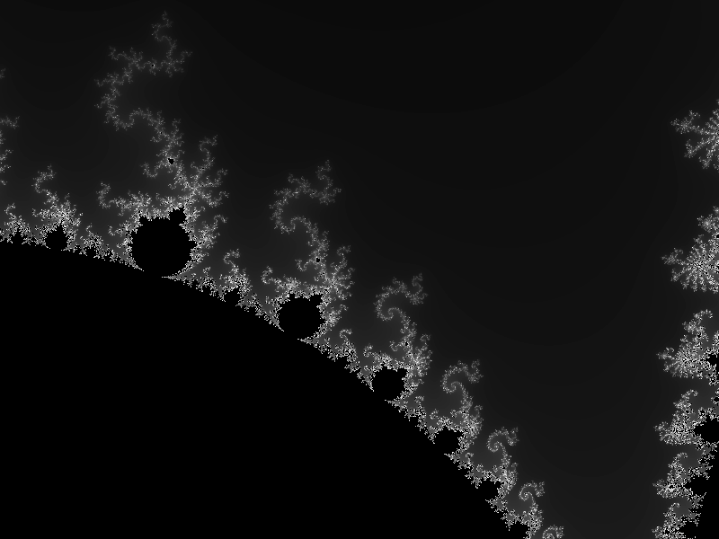

# myom

Clojure implementation of Tariq Rashid's 'Make Your own Mandelbrot' as a Quil sketch 

## Usage

Emacs - run cider, open `core.clj` and press `C-c C-k` to evaluate the file.

REPL - run `(require 'myom.core)`.

LightTable - open `core.clj` and press `Ctrl+Shift+Enter` to evaluate the file.

- Mouse-click on the image to zoom in on the cursor
- Type 's' to save a copy of the current view
- Type '+' to double the current maximum number of iterations
- Type '-' to halve the current maximum number of iterations

## Notes

Won't currently work on Mac with JDK > 8 at the moment [because
reasons](https://github.com/processing/processing/issues/5746).

$ jenv 1.8
$ export JAVA_OPTS=-Djava.awt.headless=false

## License

Copyright © 2016 Joel

Distributed under the Eclipse Public License either version 1.0 or (at
your option) any later version.
